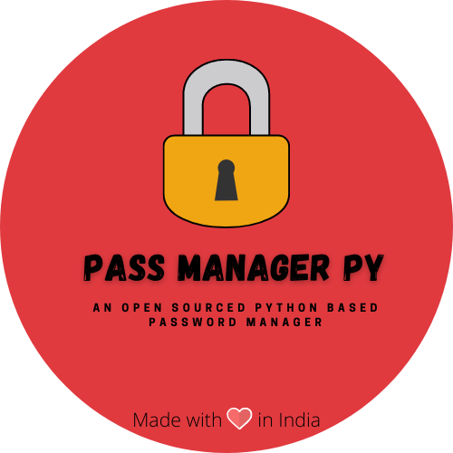

    
    

    An awesome open-sourced password manager!
     
    <a href="https://github.com/SamDev98/password-manager-py/tree/dev#current-implementations-available"><strong>Explore the docs »</strong></a>
     
     
    <a href="docs/demo.md">View Demo</a>
    ·
    <a href="https://github.com/SamDev98/password-manager-py/issues/new/choose">Report Bug</a>
    ·
    <a href="https://github.com/SamDev98/password-manager-py/discussions/new">Request Feature</a>
  

## 🐍 Python Password Manager 🔐

### An extensive password manager built using Python ✨

Multiple implementations for a password manager, all based on python. Choose an implementation based on what features
you'd like!
 
More implementations on the way!
 
Checkout the demo of the applications [here](docs/demo.md).
 
Note: If you're new here, checkout the [main](https://github.com/srakhe/pass-manager-py/tree/main) branch instead, the dev branch is for development of new features only.

### Current implementations available:

|                  Title                    |                                                              Description                                                                |            Storage            |                                                 Screenshots                                                    |            Documentations                |
|:---------------------------------------:	|:-------------------------------------------------------------------------------------------------------------------------------------:	|:----------------------------:	|:----------------------------------------------------------------------------------------------------------:	|:------------------------------------:	|
| Desktop GUI Application:Encrypted Files    |                   A Tkinter based desktop GUI application that uses locally stored encrypted files for data storage.                    | Local-only, Encrypted files.    | [Here!](https://github.com/SamDev98/password-manager-py/blob/main/docs/Tk_encrypted_README.md#screenshots)    | [Here!](docs/Tk_encrypted_README.md)    |
|    Terminal GUI Application: Mongodb        | A Terminal based GUI application, that is fast, lightweight and simple. Gets the job done quickly. It uses Mongo Db for data storage.    |    Local/Hosted, Mongo db.    |   [Here!](https://github.com/SamDev98/password-manager-py/blob/main/docs/Tui_mongo_README.md#screenshots)    |   [Here!](docs/Tui_mongo_README.md)    |

To request more features/implementations, please create an issue or add an idea in the discussions on the repo. :)
 

**NOTE**: Before contributing, please read [this](CONTRIBUTING.md). Contributions of any kind welcome and appreciated!
